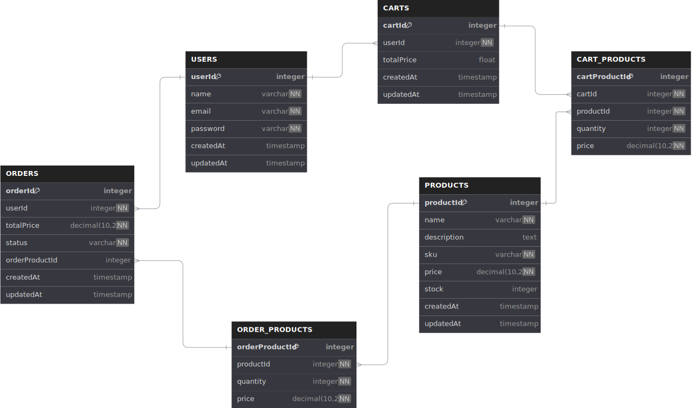
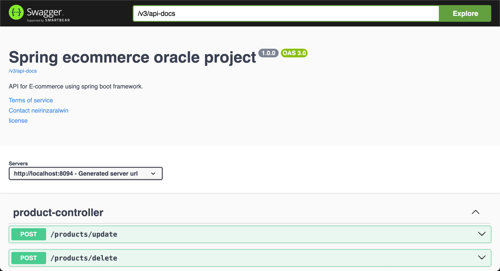
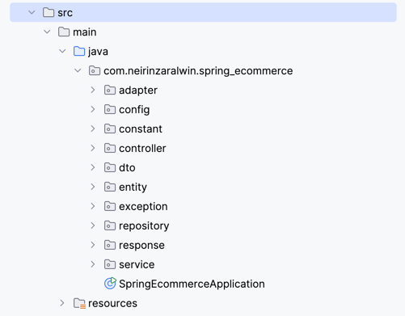

<p>&nbsp;&nbsp;&nbsp;&nbsp;&nbsp;&nbsp;</p>
<p align="center">

</p>
<p align="center">
  <h1 align="center">Spring Ecom Oracle Code Test</h1>
</p>
<!-- <h4 align="center">
    <a href="https://evershop.io/docs/development/getting-started/introduction">Documentation</a> |
    <a href="https://demo.evershop.io/">Demo</a>
</h4> -->

<p align="center">
  <a href="https://www.linkedin.com/in/nei-rin-zara-lwin/"></a>
  <a href="https://github.com/neirinzaralwin"></a>
  <a href="public/postman/Spring-ecom-oracle.postman_collection.json"></a>
    
</p>

## Introduction

This project is a Oracle based and Spring boot ecommerce api for code test purpose.

## Table of content

- [ER Diagram](#er-diagram).

- [Installation](#installation).

- [Code Structure Explanation](#code-structure-explanation).

## ER Diagram

</br>
<div align="center">

</div>
</br>

### User/Admin Story Line

- Create account with name,email and password
- Login with email and password
- User(Admin in this case) can create, update, delete product
- Add to shopping cart
- Checkout to order

### 1. USERS Table

- **Purpose**: Stores user information.
- **Fields**:
    - `userId`: Auto-incrementing primary key (unique for each user).
    - `name`: User's name (cannot be null).
    - `email`: User's email, which must be unique (cannot be null).
    - `password`: User's password (cannot be null).
    - `createdAt`: Timestamp of when the user was created, with a default value of the current timestamp.
    - `updatedAt`: Timestamp of when the user information was last updated, also defaults to the current timestamp.

### 2. CARTS Table

- **Purpose**: Represents a shopping cart for each user.
- **Fields**:
    - `cartId`: Auto-incrementing primary key (unique for each cart).
    - `userId`: Foreign key referencing the `USERS` table, linking each cart to a specific user (cannot be null).
    - `totalPrice`: The total price of the items in the cart.
    - `createdAt`: Timestamp of when the cart was created, defaults to the current timestamp.
    - `updatedAt`: Timestamp of when the cart was last updated, defaults to the current timestamp.

### 3. PRODUCTS Table

- **Purpose**: Stores product details.
- **Fields**:
    - `productId`: Auto-incrementing primary key (unique for each product).
    - `name`: Name of the product (cannot be null).
    - `description`: Description of the product.
    - `sku`: Stock Keeping Unit, a unique identifier for each product (cannot be null).
    - `price`: Price of the product with two decimal points (cannot be null).
    - `stock`: Current stock of the product, defaults to 0.
    - `createdAt`: Timestamp of when the product was added, defaults to the current timestamp.
    - `updatedAt`: Timestamp of when the product was last updated, defaults to the current timestamp.

### 4. CART_PRODUCTS Table

- **Purpose**: Associates products with carts, recording what products are in a cart.
- **Fields**:
    - `cartProductId`: Auto-incrementing primary key (unique for each cart-product relation).
    - `cartId`: Foreign key referencing the `CARTS` table (cannot be null).
    - `productId`: Foreign key referencing the `PRODUCTS` table (cannot be null).
    - `quantity`: The quantity of the product in the cart (cannot be null).
    - `price`: The price of the product at the time of adding it to the cart (cannot be null).

### 5. ORDERS Table

- **Purpose**: Stores details of user orders.
- **Fields**:
    - `orderId`: Auto-incrementing primary key (unique for each order).
    - `userId`: Foreign key referencing the `USERS` table (cannot be null).
    - `totalPrice`: Total price of the order (cannot be null).
    - `status`: The current status of the order (e.g., 'PENDING'), with a default value of 'PENDING'.
    - `orderProductId`: Foreign key referencing the `ORDER_PRODUCTS` table.
    - `createdAt`: Timestamp of when the order was placed, defaults to the current timestamp.
    - `updatedAt`: Timestamp of when the order was last updated, defaults to the current timestamp.

### 6. ORDER_PRODUCTS Table

- **Purpose**: Tracks products associated with each order.
- **Fields**:
    - `orderProductId`: Auto-incrementing primary key (unique for each order-product relation).
    - `productId`: Foreign key referencing the `PRODUCTS` table (cannot be null).
    - `quantity`: The quantity of the product in the order (cannot be null).
    - `price`: The price of the product at the time of the order (cannot be null).

### Relationships

- The `USERS` table is linked to both `CARTS` and `ORDERS` through foreign keys (`userId`).
- `CARTS` is associated with `CART_PRODUCTS`, which connects specific products (`PRODUCTS`) to a user's cart.
- `ORDERS` is connected to `ORDER_PRODUCTS`, which tracks what products were purchased in each order.

## Installation

### 1. Installation of oracle using Docker

Since I'm using m1 mackbook, I use docker to install oracle database on my machine locally.

You have to clone docker image repository from oracle's github.

```bash
git clone https://github.com/oracle/docker-images
```

Download oracle database software from [here](https://www.oracle.com/database/technologies/oracle-database-software-downloads.html)

This is installation video along with docker and oracle. You can watch and follow the steps. <br>
https://www.youtube.com/watch?v=uxvoMhkKUPE&t=576s

### 2. Install SQL Developer

https://www.oracle.com/database/sqldeveloper/

<p>Create database using SQL Developer</p>
<p>Port number : 1521</p>
<p>Service Name: ORCLCDB</p>
<p>username : SYS as SYSDBA</p>
<p>password: mypassword1</p>

### 3. pom.xml

```xml
    <dependencies>
		<dependency>
			<groupId>org.springframework.boot</groupId>
			<artifactId>spring-boot-starter-data-jpa</artifactId>
		</dependency>
		<dependency>
			<groupId>org.springframework.boot</groupId>
			<artifactId>spring-boot-starter-web</artifactId>
		</dependency>

		<dependency>
			<groupId>com.oracle.database.jdbc</groupId>
			<artifactId>ojdbc11</artifactId>
			<scope>runtime</scope>
		</dependency>
		<dependency>
			<groupId>org.springframework.boot</groupId>
			<artifactId>spring-boot-starter-test</artifactId>
			<scope>test</scope>
		</dependency>
		<!--Spring security-->
		<dependency>
			<groupId>org.springframework.boot</groupId>
			<artifactId>spring-boot-starter-security</artifactId>
		</dependency>
		<dependency>
			<groupId>org.springframework.security</groupId>
			<artifactId>spring-security-core</artifactId>
			<version>6.3.3</version>
		</dependency>
		<dependency>
			<groupId>org.springframework.security</groupId>
			<artifactId>spring-security-config</artifactId>
			<version>6.3.3</version>
		</dependency>
		<!--Jwt-->
		<dependency>
			<groupId>io.jsonwebtoken</groupId>
			<artifactId>jjwt-api</artifactId>
			<version>0.11.5</version>
		</dependency>
		<dependency>
			<groupId>io.jsonwebtoken</groupId>
			<artifactId>jjwt-impl</artifactId>
			<version>0.11.5</version>
		</dependency>
		<dependency>
			<groupId>io.jsonwebtoken</groupId>
			<artifactId>jjwt-jackson</artifactId>
			<version>0.11.5</version>
		</dependency>
		<!--Swagger ui-->
		<dependency>
			<groupId>org.springdoc</groupId>
			<artifactId>springdoc-openapi-starter-webmvc-ui</artifactId>
			<version>2.6.0</version>
		</dependency>
	</dependencies>
```

### 4. application.properties

```properties
spring.application.name=spring-ecommerce

# create and drop tables
#ddl-auto Options:
#none: No action will be taken regarding the schema.
#validate: Hibernate only validates whether the schema is correct.
#update: Updates the schema to match the entities without dropping data.
#create: Drops existing schema and re-creates the database schema on each run.
#create-drop: Drops the schema at the end of the session as well.
spring.jpa.hibernate.ddl-auto=update

# Oracle settings
spring.datasource.url=jdbc:oracle:thin:@localhost:1521:ORCLCDB
spring.datasource.username=sys as sysdba
spring.datasource.password=mypassword1
spring.datasource.driver-class-name=oracle.jdbc.driver.OracleDriver

# Hibernate dialect
spring.jpa.database-platform=org.hibernate.dialect.OracleDialect

# Server port
server.port=8094

# JWT settings
security.jwt.secret-key=3cfa76ef14937c1c0ea519f8fc057a80fcd04a7420f8e8bcd0a7567c272e007b
# 1day in millisecond
security.jwt.expiration-time=86400000
```

<p style="color:red;">Note: Please don't share secret key on realworld project. Using .env file would be best practice to store data in local machine enviroment.</p>

### 5. Run

Run -> **http://localhost:8094** on your browser or postman.

API Documentation -> **http://localhost:8094/swagger-ui/index.html**

</br>
<div align="center">

</div>
</br>

## Code Structure Explanation

</br>
<div align="center">

</div>
</br>

I followed a **layered architecture**, commonly used in Spring Boot applications which contains **Presentation Layer, Service Layer, Data Acess Layer and Adapter Layer**.

1. **SpringEcommerceApplication.java** is the main file that will start the application from root.
2. **Presentation Layer** contains **Controllers** which are UserController, CartController and so on.
3. **Service Layer** contains **Services** which are Authentication Service, User Services and so on.
4. **Data Access Layer** contains **Data Transfer Object (DTO)** and **Entities** which contains **response/LoginResponse, dto/LoginUserDto, dto/RegisterUserDto** and so on.
5. **Adpater Layer** contains adapter which will transform cart's product to order which is also a adapter pattern which is one of the most porpular patterns.
6. **Configuration** are take part in crucial role of the application which control routes, filter security, verifying or generating the JWT token.
7. **Exception Handler**, **exception/GlobalExceptinHandler.java** will take all of error throws from the application happening in the runtime.
8. **Enum** are set to define orderstatus.

Note: I used **JPA with Hibernate**, an ORM framework which allows us to map Java objects (entities) to relational database tables. This makes it easier to work with databases in an object-oriented way, avoiding the complexity of writing SQL queries manually.

## License
<a href="LICENSE.txt">MIT License</a>